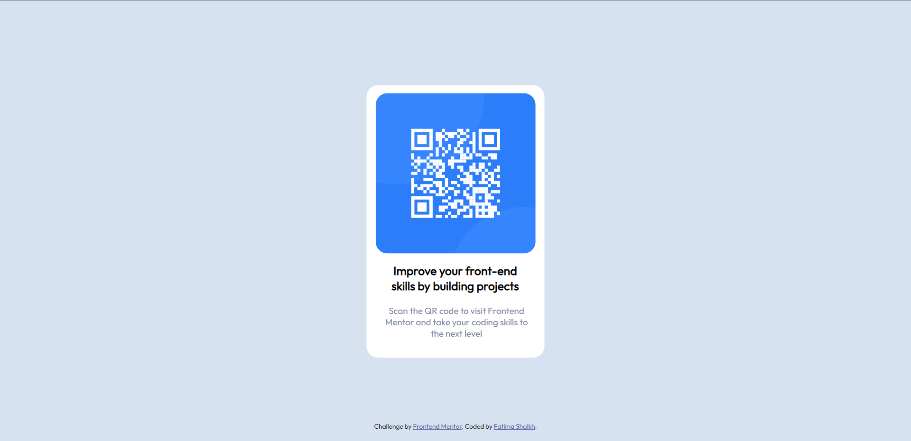

# QR-code-component
# Frontend Mentor - QR code component solution

This is a solution to the [QR code component challenge on Frontend Mentor](https://www.frontendmentor.io/challenges/qr-code-component-iux_sIO_H). Frontend Mentor challenges help you improve your coding skills by building realistic projects. 

## Table of contents

- [Overview](#overview)
  - [Screenshot](#screenshot)
  - [Links](#links)
- [My process](#my-process)
  - [Built with](#built-with)
  - [What I learned](#what-i-learned)
- [Author](#author)


## Overview

### Screenshot



### Links

- Solution URL: [Add solution URL here](https://your-solution-url.com)
- Live Site URL: [Add live site URL here](https://fash1462.github.io/QR-code-component/)

## My process

### Built with

- Semantic HTML5 markup
- CSS custom properties
- Flexbox

### What I learned

Some of my major learnings while working through this project. 

```html
<link rel="icon" type="image/png" sizes="32x32" href="./images/favicon-32x32.png">
```
```css
.qr-box{
    position: absolute;
    top: 3%;
    left: 50%;
    transform: translate(-50%, 0);
    height: 270px;
    width: 270px;
    border-radius: 20px;
}
```

## Author

- Frontend Mentor - [@fash1462](https://www.frontendmentor.io/profile/fash1462)
